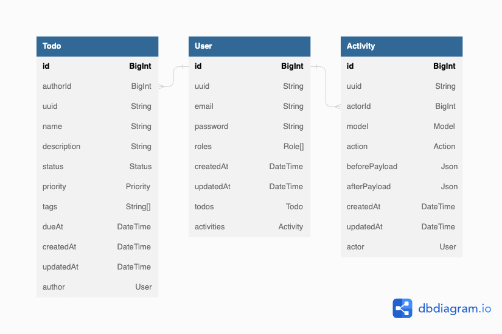
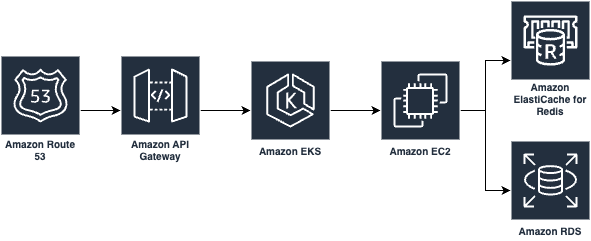

# Todo

## Prerequisite

- [Node v18.15.0](https://github.com/nvm-sh/nvm#installing-and-updating)
- [docker-compose](https://www.docker.com/products/docker-desktop/)

## Setup local environment


### Install dependencies

```bash
yarn
cp .env.example .env
cp .env.test.example .env.test
```

### Start dependency services

```bash
docker-compose up -d
```

### Create database

```bash
PGPASSWORD=postgres psql -h 127.0.0.1 -U postgres
CREATE DATABASE todo_dev;
CREATE DATABASE todo_test;
```

> NOTE: You can use any database manager to connect the db :)

### Migrate database

```bash
yarn prisma migrate dev
```

### Start app

```bash
yarn start:dev
```

Now you can go http://localhost:3000/docs to play around

**Default Credentials**

```
email                password         role   
admin@example.com    examplepassword  Admin
user@example.com     examplepassword  User
ro-user@example.com  examplepassword  Readonly User
```

## Technical document

### Database design



### System design



### Features

- Authentication & Authorization
- API versioning
- Todo CRUD with Redis Caching
- Activity Feed
- Swagger DOC
- Opentelemetry tracing
- Healthcheck endpoint
- Security headers
- Logging

#### Authentication & Authorization

Exposed two endpoints `/v1/login` & `/v1/register` for login and register purpose, it returns jwt for bearer token. 
claim based authorization is applied to user based on user's roles:

```js
// Everyone can read activity feed
can(Action.Read, 'Activity');

if (user.roles.includes('READONLY_USER')) {
  can(Action.Read, 'Todo');
}

if (user.roles.includes('USER')) {
  can(Action.Create, 'Todo');
  can(Action.Read, 'Todo');
  can(Action.Update, 'Todo', { authorId: user.id }); // User can only edit their own todo
  can(Action.Delete, 'Todo', { authorId: user.id });
}

if (user.roles.includes('ADMIN')) {
  can(Action.Create, 'Todo');
  can(Action.Read, 'Todo');
  can(Action.Update, 'Todo');
  can(Action.Delete, 'Todo');
}
```

Follow up action:
- [ ] Enforce stricter password policy
- [ ] Apply rate-limiting to these two endpoints

#### API versioning

API Versioning is enabled for the ease of introduce v2 api, right now all resource endpoints are prefixed with `/v1`

#### Todo CRUD with Redis Caching

Basic CRUD endpoints with fluent api for filtering and sorting.
Considering `status`, `priority` and `tags` that it can be search by multiple values.
And for datetime column like `dueAt` that it can be range search.

Redis Caching is enabled for get endpoints: `/v1/todos` and `/v1/todos/:uuid` for performance optimization

Follow up action:
- [ ] Better swagger doc

#### Activity Feed

Currently, js event emitter is used for emitting `DeltaChangedEvent` and `DeltaChangedListener` will listen for the event and insert records to database. RabbitMQ is recommended to use for a larger scale application

```js
this.eventEmitter.emit(
  'delta.changed',
  new DeltaChangedEvent({
    actorId: user.id,
    model: 'Todo',
    action: 'CREATE',
    afterPayload: todo,
  }),
);
```

Follow up action:
- [ ] Use message queue instead (eg: RabbitMQ)

#### Swagger DOC

Swagger doc is provided via http://localhost:3000/docs

#### Opentelemetry tracing

Opentelemetry tracing is enabled in this application. With tracing enabled, we can found performance issue easily.
`http` (http request), `express` (http server), `nest` (app), `prisma` (db), `ioredis` instrumentation is enabled.
Also, b3 propagator is configured for passing `traceId` and `spanId` from upstream to downstream. 

Jaeger UI: http://localhost:16686/

Follow up action:
- [ ] Use elastic search + kibana?

#### Healthcheck endpoint

Healthcheck endpoint is implement for monitoring purpose. Dependency services are monitored too.

```json
{
  "status": "ok",
  "info": {
    "masterDb": {
      "status": "up"
    },
    "readOnlyDb": {
      "status": "up"
    },
    "redis": {
      "status": "up"
    }
  },
  "error": {
    
  },
  "details": {
    "masterDb": {
      "status": "up"
    },
    "readOnlyDb": {
      "status": "up"
    },
    "redis": {
      "status": "up"
    }
  }
}
```

#### Security headers

Security headers like `Content-Security-Policy`, `Strict-Transport-Security`, `X-Frame-Options` are implemented via `helmet` package.

#### Logging

Pino logger is used for logging. In development mode, pretty print is enabled for better DX.

### API Document

> Note: Swagger UI is always better

# Code Test API Doc


## Version: v1


### /health

#### GET
##### Parameters

| Name | Located in | Description | Required | Schema |
| ---- | ---------- | ----------- | -------- | ---- |

##### Responses

| Code | Description |
| ---- | ----------- |
| 200 | The Health Check is successful |
| 503 | The Health Check is not successful |

### /v1/todos

#### POST
##### Parameters

| Name | Located in | Description | Required | Schema |
| ---- | ---------- | ----------- | -------- | ---- |

##### Responses

| Code | Description |
| ---- | ----------- |
| 201 |  |

##### Security

| Security Schema | Scopes |
| --- | --- |
| auth | |

#### GET
##### Parameters

| Name | Located in | Description | Required | Schema |
| ---- | ---------- | ----------- | -------- | ---- |
| filter.status | query | available operators: `$eq`, `$in` | No |  |
| filter.priority | query | available operators: `$eq`, `$in` | No |  |
| filter.tags | query | available operators: `$eq`, `$in` | No |  |
| filter.dueAt | query | available operators: `$btw`, `$lte`, `$gte` | No |  |
| sort | query | available fields: `name`, `status`, `dueAt`, `createdAt`, `priority` | No | string |
| page.on | query |  | No | number |
| page.limit | query |  | No | number |

##### Responses

| Code | Description |
| ---- | ----------- |
| 200 |  |

##### Security

| Security Schema | Scopes |
| --- | --- |
| auth | |

### /v1/todos/{uuid}

#### GET
##### Parameters

| Name | Located in | Description | Required | Schema |
| ---- | ---------- | ----------- | -------- | ---- |
| uuid | path |  | Yes | string |

##### Responses

| Code | Description |
| ---- | ----------- |
| 200 |  |

##### Security

| Security Schema | Scopes |
| --- | --- |
| auth | |

#### PATCH
##### Parameters

| Name | Located in | Description | Required | Schema |
| ---- | ---------- | ----------- | -------- | ---- |
| uuid | path |  | Yes | string |

##### Responses

| Code | Description |
| ---- | ----------- |
| 200 |  |

##### Security

| Security Schema | Scopes |
| --- | --- |
| auth | |

#### DELETE
##### Parameters

| Name | Located in | Description | Required | Schema |
| ---- | ---------- | ----------- | -------- | ---- |
| uuid | path |  | Yes | string |

##### Responses

| Code | Description |
| ---- | ----------- |
| 200 |  |

##### Security

| Security Schema | Scopes |
| --- | --- |
| auth | |

### /v1/auth/login

#### POST
##### Parameters

| Name | Located in | Description | Required | Schema |
| ---- | ---------- | ----------- | -------- | ---- |

##### Responses

| Code | Description |
| ---- | ----------- |
| 200 |  |

### /v1/auth/register

#### POST
##### Parameters

| Name | Located in | Description | Required | Schema |
| ---- | ---------- | ----------- | -------- | ---- |

##### Responses

| Code | Description |
| ---- | ----------- |
| 200 |  |

### /v1/activities

#### GET
##### Parameters

| Name | Located in | Description | Required | Schema |
| ---- | ---------- | ----------- | -------- | ---- |
| sort | query | available fields: `createdAt` | No | string |
| page.on | query |  | No | number |
| page.limit | query |  | No | number |

##### Responses

| Code | Description |
| ---- | ----------- |
| 200 |  |

##### Security

| Security Schema | Scopes |
| --- | --- |
| auth | |
